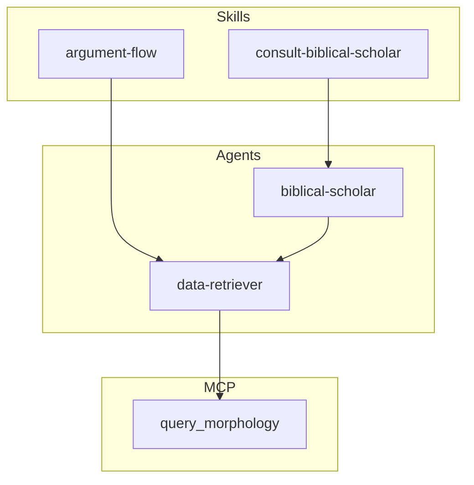

# Build dependency graph for Claude of Alexandria plugin

Produce a **refreshed dependency graph report** from the **physical plugin structure only**. The graph must be derived solely from files that exist (agents, skills, commands, MCP tool descriptors). Do **not** use docs, roadmaps, usage reports, or any other documentation to infer dependencies — only what you find by reading the actual plugin and MCP descriptor files.

## 1. Traverse the plugin and collect dependencies

**Allowed sources (physical structure only):**

- File system: `plugins/claude-of-alexandria/agents/*.md`, `plugins/claude-of-alexandria/skills/*/SKILL.md`, `.claude/commands/*.md` (if present), MCP tool descriptor files (e.g. `mcps/.../tools/*.json`).
- Content of those files only: frontmatter (`subagent_type`, etc.), body text (MCP tool names, explicit references to other skills/agents).

**Forbidden sources:** Any file under `docs/` (reports, plans, roadmaps, architecture notes), READMEs or external “factual” descriptions of how things are used. Do not add edges or nodes based on documentation — only on what the plugin files and MCP descriptors actually contain.

- **Agents** (`plugins/claude-of-alexandria/agents/*.md`)
  - From each agent file: read YAML frontmatter for `subagent_type` (spawned sub-agents).
  - From body: note any MCP tool names mentioned (e.g. `query_morphology`, `list_books`, `query_discourse_features`, `query_paragraph_breaks`, `query_vocabulary`, `query_ot_quotes`, `query_lemmas`, `query_themes_for_lemmas`, `query_theme`).

- **Skills** (`plugins/claude-of-alexandria/skills/*/SKILL.md`)
  - From each skill: extract `subagent_type` (if present) for spawned agents.
  - From body: extract MCP tool names (direct calls or fallback), and any references to other skills or agents by name.

- **MCP tools** (canonical list from CoA MCP server)
  - Use the MCP tool descriptors under the project’s MCP files (e.g. `mcps/plugin-claude-of-alexandria-claude-of-alexandria-mcp/tools/*.json`) to get the definitive list of tool names. If that path is not available, infer from skill/agent content: `list_books`, `query_morphology`, `query_vocabulary`, `query_discourse_features`, `query_paragraph_breaks`, `query_ot_quotes`, `query_theme`, `query_lemmas`, `query_themes_for_lemmas`.

- **Commands** (optional, only if present on disk)
  - If `.claude/commands/*.md` or plugin `commands/*.md` exist, read their content only; add command → skill/agent edges only where the command file text explicitly references a skill or agent name.

- **Tests** (optional)
  - Only the existence of `tests/promptfoo/skills/<name>/` and `tests/promptfoo/agents/<name>/` directories (physical structure) may be used to list which skills/agents are tested. Do not use test docs or rubrics to infer dependency edges.

## 2. Build the graph model

- **Nodes:** Agents, Skills, MCP tools. Optionally: Commands (if present), Test configs (if you include them).
- **Edges:**
  - **Spawns:** Skill or Agent → Agent (from `subagent_type`).
  - **Calls MCP:** Agent or Skill → MCP tool (primary or fallback path).
  - **Uses skill:** Only if a command or agent explicitly invokes a skill by name (document if you find it).

Use consistent, URL-safe IDs in Mermaid (e.g. `data-retriever`, `biblical-scholar`, `argument-flow`, `query_morphology`).

## 3. Write the report

- **Path:** `docs/reports/YYYY-MM-DD-coa-dependency-graph.md` (use today’s date for `YYYY-MM-DD`).
- **Contents:**
  - Title: e.g. `# Claude of Alexandria — Plugin Dependency Graph`
  - **Generated:** `YYYY-MM-DD` (date of generation).
  - Short paragraph describing what the graph represents (plugin agents, skills, MCP tools, spawn/call relationships).
  - A **Mermaid diagram** (flowchart or graph) showing:
    - Subgraphs for clarity (e.g. Agents, Skills, MCP tools).
    - Directed edges for spawns and MCP calls (and fallbacks if you want a dashed line).
  - Optional: a small table summarizing “Agent X spawns Y”, “Skill Z calls MCP tools A, B” for quick reference.

Use a Mermaid code block so the diagram renders in Markdown viewers that support it.

**Mermaid style:** Use `flowchart TB` or `flowchart LR` with `subgraph` for Agents, Skills, and MCP tools. Use `-->` for spawns and `-->` or `-.->` for MCP calls (solid = primary, dashed = fallback). Example shape:

## 4. Validation

- Every agent and skill under `plugins/claude-of-alexandria/` is represented as a node.
- Every `subagent_type` value appears as an edge from the caller to the named agent.
- MCP tools referenced in skills/agents appear as nodes and have incoming edges from the callers.
- The report file is valid Markdown and the Mermaid block is syntactically correct (no stray characters, balanced brackets).
- The graph is derived from physical structure only; no nodes or edges may come from docs, roadmaps, or usage reports.

Do not invent dependencies: only add edges you found by reading the plugin files and MCP descriptors. If a skill or agent mentions “fallback to direct MCP”, draw an edge from that skill/agent to the relevant MCP tools as well.
