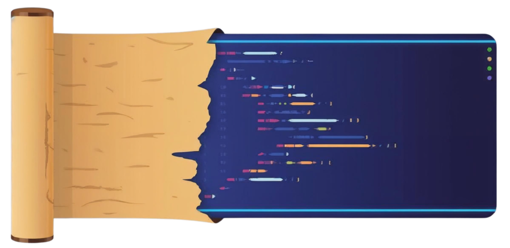

<h1 align="center">Claude of Alexandria</h1>

<p align="center">
  
</p>

<p align="center">
  <em>Est. 2026 AD — A considerably younger library than the original, but no less particular about methodology.</em>
</p>

<p align="center">
  <a href="#installation"></a>
  <a href="LICENSE"></a>
  <a href="#current-collection"></a>
  <a href="#hermeneutical-framework"></a>
</p>

---

**AI agent skills for rigorous biblical study and preparation**, built on faithful exegetical and homiletical principles.

Or as we say in the stacks: _structured frameworks that prevent your AI from committing exegetical malpractice_.

## Greetings, Scholar

You have entered the library.

The original Library of Alexandria housed roughly 400,000 scrolls and employed a classification system that was, by modern standards, vibes-based. We have improved upon this. Our collection is smaller — one skill, at present — but each scroll has been rigorously tested against the systematic failures of frontier language models, which is more than Zenodotus ever managed.

**Claude of Alexandria** is a [Claude](https://claude.ai/code) plugin providing analytical skills for biblical study and teaching preparation. The system prioritizes:

- **Rigorous biblical scholarship** — Linguistic analysis, historical context, and theological integration. We do not guess.
- **Theological integrity** — Anti-moralism mandate, Christ-centeredness, and gospel focus. We do not moralize.
- **Zero recurring costs** — Leverages the internal knowledge of frontier models. We do not charge subscription fees. The ancient library was publicly funded and we respect the tradition.
- **Skill-based architecture** — Modular, composable, stateless skills. We do not build monoliths. We learned that lesson in 48 BC.

## "But Surely Modern AI Handles Scripture Well Enough?"

No. It does not. We have the test results.

Even sophisticated frontier models make predictable errors under pressure — prioritizing felt needs over textual diagnosis, psychologizing passages, and defaulting to therapeutic frameworks. They will, if left unsupervised, turn the Epistle to the Romans into a self-help pamphlet.

When planning teaching series, AI agents commit the following offenses against scholarship:

- **Inventing arbitrary divisions** to satisfy session counts ("8 weeks on Philemon" — a book shorter than most README files)
- **Presenting single frameworks** for contested books as if scholarly consensus exists where it does not
- **Auto-selecting options** instead of presenting alternatives, which is the exegetical equivalent of hiding the bibliography
- **Ignoring ancient manuscript markers** — Masoretic פ/ס divisions, Levinsohn discourse features — because apparently 2,500 years of scribal tradition is insufficient for consideration

Every skill in this library is built using **Test-Driven Development**. We first document precisely how the model fails. Then we build the minimum framework to prevent those failures. Then we close every loophole an agent might use to rationalize its way around the constraints.

The ancient librarians catalogued. We do the same — we catalogue failures, then eliminate them.

### The Evidence

We do not ask you to trust our methodology. We ask you to read the test results. Every skill includes:

| File                                      | Purpose                                                      |
| ----------------------------------------- | ------------------------------------------------------------ |
| `tests/skills/skill-name/scenarios.md`    | Pressure test cases designed to trigger failures             |
| `tests/skills/skill-name/baseline.md`     | Documented failures without the skill (the RED phase)        |
| `tests/skills/skill-name/verification.md` | Proof that the skill corrects the failures (the GREEN phase) |

If a skill cannot demonstrate that it prevents a documented failure, it does not belong in this library. We have standards.

## Current Collection

The library presently contains **one skill**. Rome was not catalogued in a day.

### [biblical-segmentation](plugins/claude-of-alexandria/skills/biblical-segmentation/)

Divides biblical books into coherent teaching units — sermon series, small groups, devotional reading — with integrity safeguards that would make a Masoretic scribe nod approvingly:

- **Refuses impossible divisions.** You cannot divide Philemon into 12 sessions. We will not pretend otherwise.
- **Presents multiple scholarly-grounded options.** Because interpretation is not a dictatorship.
- **Validates against ancient manuscript markers.** Masoretic פ/ס divisions, Levinsohn discourse features. The scribes marked these boundaries for a reason.
- **Handles contested books with multiple frameworks.** Isaiah's unity debate gets frameworks, not a false consensus.

Coverage: all 66 canonical books. We are nothing if not thorough.

## Installation

### From Claude Marketplace

```bash
claude marketplace install davebream/claude-of-alexandria
```

That's it. The scrolls are now on your shelf.

### Manual Installation (Advanced)

If you prefer manual installation or want to contribute:

```bash
# Clone the repository
git clone https://github.com/davebream/claude-of-alexandria.git
cd claude-of-alexandria

# Symlink the plugin
ln -s $(pwd)/plugins/claude-of-alexandria ~/.claude/plugins/claude-of-alexandria
```

### Verifying Your Library Card

Restart Claude, then:

```bash
# In a Claude session
/skills
```

You should see `biblical-segmentation` listed. If you do not, the shelving went poorly. Try again.

### Usage

In any Claude session:

```
Use biblical-segmentation to divide Romans into 12 sessions for a sermon series.
```

Consult the [plugin README](plugins/claude-of-alexandria/README.md) for detailed skill documentation.

## Hermeneutical Framework

Skills are built on **historical-grammatical method** with explicit theological guardrails:

| Guardrail             | What It Prevents                                            |
| --------------------- | ----------------------------------------------------------- |
| Anti-moralism mandate | "Try harder" applications without gospel grounding          |
| Christ-centeredness   | Missing the redemptive-historical arc                       |
| Context primacy       | Ripping verses from their literary and canonical home       |
| Genre governance      | Applying narrative methods to epistles (and vice versa)     |
| Covenantal awareness  | Flattening Old and New Testament into a proof-text database |

These are not suggestions. They are load-bearing walls.

## Acknowledgments

**Linguistic Foundations:**

- **Stephen H. Levinsohn** — Greek New Testament discourse analysis
- **Sefaria Project** — Masoretic Text paragraph data

**Hermeneutical Framework:**

- **Historical-Grammatical Method** (Antiochene School → Protestant Reformers → this repository)
- **Literary Context** — Boundaries must respect discourse structure, not violate it

**Architectural Inspiration:**

- The original Library of Alexandria (destroyed, but the organizational principles endure)
- The `superpowers` writing-skills methodology (Test-Driven Documentation)

## Contributing

The library welcomes contributions from those who respect the methodology. See [CLAUDE.md](CLAUDE.md) for development guidelines, but be warned: the head librarian is strict about TDD.

## License

[GNU General Public License v3.0](LICENSE) — You are free to use, study, and redistribute this work. Any derivative must remain open under the same terms. The methodology stays free. The Ptolemies would have charged you; we chose a different path.

---

<p align="center">
  <strong>Disclaimer</strong><br>
  <em>This project is an independent, open-source initiative and is not affiliated with, endorsed by, or sponsored by Anthropic PBC. "Claude" refers to Anthropic's AI assistant, for which this plugin is designed. The original Library of Alexandria is also not a sponsor, being unavailable for comment since approximately 48 BC.</em>
</p>

<p align="center">
  <sub>Production-ready. Currently contains 1 skill supporting all 66 biblical books.<br>More scrolls forthcoming. The cataloguing continues.</sub>
</p>
