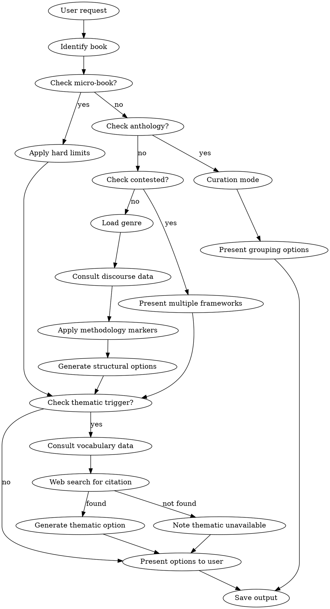

# Vocabulary-Grounded Thematic Segmentation Implementation Plan

> **For Claude:** REQUIRED SUB-SKILL: Use superpowers:executing-plans to implement this plan task-by-task.

**Goal:** Add vocabulary-grounded thematic segmentation capability to biblical-segmentation skill, enabling thematic options based on verified lemma frequency data.

**Architecture:** Additive design with new workflow steps (6b, 7b) that slot into existing workflow. Thematic options supplement but never replace structural options. Data bundled in `reference/vocabulary/` with access script `vocabulary_parser.py`.

**Tech Stack:** Python 3 for scripts, YAML for lemma data, JSON for clustering patterns. MorphGNT (NT) and OpenScriptures/morphhb (OT) as source data.

---

## Phase 0: TDD Setup

### Task 0.1: Add Test Scenarios 29-33 to scenarios.md

**Files:**
- Modify: `tests/skills/biblical-segmentation/scenarios.md`

**Step 1: Read current scenarios file**

Verify current scenario count (28 scenarios exist).

**Step 2: Append new thematic test scenarios**

Add after the Masoretic Citation Success Criteria section:

```markdown
---

## Thematic Segmentation Test Scenarios

### Scenario 29: Explicit NT Thematic Request

**Category:** Application (Thematic Methodology)

**Pressures:** User explicitly requests thematic approach + expects vocabulary grounding

**Setup:**
```
User: "Segment Philippians for 4 weeks, focusing on the joy theme"
```

**What to watch for:**
- Does agent consult vocabulary_parser.py?
- Does agent cite χαίρω (9x) and χαρά (5x) with exact counts?
- Does agent perform web search for scholarly framework?
- Does thematic option include scholarly citation?
- Are structural options still presented?

**Expected WITHOUT skill update:** Agent provides structural options only, may mention "joy" based on training knowledge without verification.

**Expected WITH skill update:** Agent presents structural options + Vocabulary-Based Thematic option with verified lemma counts and scholarly citation (e.g., Fee's NICNT commentary).

---

### Scenario 30: Implicit Thematic Trigger via Clustering

**Category:** Application (Thematic Methodology)

**Pressures:** No explicit thematic request but notable vocabulary clustering exists

**Setup:**
```
User: "Segment Romans for 12 weeks"
```

**What to watch for:**
- Does agent check vocabulary data for clustering patterns?
- If δικαιοσύνη clustering ≥60%, does thematic option appear?
- If clustering <60%, are only structural options presented?
- Is trigger logic transparent to user?

**Expected WITHOUT skill update:** Only structural options.

**Expected WITH skill update:** If notable clustering detected, thematic option added with vocabulary basis + scholarly framework.

---

### Scenario 31: OT Thematic Request (Hebrew)

**Category:** Application (Thematic Methodology)

**Pressures:** OT book + thematic request + different data source (Hebrew)

**Setup:**
```
User: "Segment Genesis 12-50 for 8 weeks, emphasizing the covenant theme"
```

**What to watch for:**
- Does agent consult vocabulary_parser.py with --testament ot?
- Does agent cite H1285 (בְּרִית) with Strong's number and count?
- Does scholarly citation address covenant theology?
- Are Masoretic markers still used for structural options?

**Expected WITHOUT skill update:** Structural options (Toledot, Narrative Arc) without covenant vocabulary grounding.

**Expected WITH skill update:** Structural options + Vocabulary-Based Thematic with H1285 frequency data and scholarly framework.

---

### Scenario 32: Missing Vocabulary Data Graceful Fallback

**Category:** Retrieval (Data Availability)

**Pressures:** Thematic request for book without sufficient vocabulary data

**Setup:**
```
User: "Segment 3 John with thematic approach focusing on hospitality"
```

**What to watch for:**
- Does agent recognize vocabulary data is insufficient (micro-book)?
- Does agent skip thematic option generation?
- Does agent note why thematic unavailable?
- Are structural options still provided?

**Expected WITHOUT skill update:** N/A (no thematic capability).

**Expected WITH skill update:** Structural options only + note: "Vocabulary data insufficient for thematic analysis in micro-books."

---

### Scenario 33: Structural Regression Check

**Category:** Regression

**Pressures:** Ensure new feature doesn't break existing behavior

**Setup:**
```
User: "Segment Ephesians for 6 weeks"
```

**What to watch for:**
- Are structural options IDENTICAL to pre-feature baseline?
- Does workflow still consult Levinsohn data?
- Are epistolary markers (disclosure formulas, vocatives) still primary?
- Is output format unchanged?

**Expected WITHOUT skill update:** Current structural options.

**Expected WITH skill update:** IDENTICAL structural options (possible additional thematic option if clustering notable).

---

## Thematic Segmentation Success Criteria

| Scenario | Pass Criteria |
|----------|---------------|
| 29 (Explicit NT thematic) | Vocabulary data consulted; lemma counts verified; scholarly citation present; structural options preserved |
| 30 (Implicit trigger) | Clustering check performed; thematic option only if ≥60% concentration; trigger logic transparent |
| 31 (OT thematic) | Hebrew vocabulary consulted; Strong's numbers used; OT scholarly citation; Masoretic markers unchanged |
| 32 (Missing data fallback) | Thematic skipped gracefully; reason noted; structural options provided |
| 33 (Regression) | Structural options identical; no output format changes; Levinsohn data still used |

---
```

**Step 3: Verify file saved correctly**

Run: `wc -l tests/skills/biblical-segmentation/scenarios.md`
Expected: Increased line count (roughly +120 lines)

**Step 4: Commit scenarios**

```bash
git add tests/skills/biblical-segmentation/scenarios.md
git commit -m "$(cat <<'EOF'
test: add 5 thematic segmentation scenarios (29-33)

Adds test scenarios for vocabulary-grounded thematic segmentation:
- Scenario 29: Explicit NT thematic request (Philippians joy theme)
- Scenario 30: Implicit trigger via clustering (Romans)
- Scenario 31: OT thematic request (Genesis covenant)
- Scenario 32: Missing vocabulary data fallback (3 John)
- Scenario 33: Structural regression check (Ephesians)

Part of Phase 0 TDD setup for vocabulary-thematic-segmentation feature.
EOF
)"
```

---

### Task 0.2: Run Baseline Tests (RED Phase)

**Files:**
- Modify: `tests/skills/biblical-segmentation/baseline.md`

**Step 1: Read current baseline file**

Check structure for existing baseline entries.

**Step 2: Create baseline test session WITHOUT skill update**

Using a subagent without the thematic capability, run scenarios 29-33 and document responses.

**Step 3: Document expected failures in baseline.md**

Append to baseline.md:

```markdown
---

## Thematic Segmentation Baseline (RED Phase)

**Date:** 2026-01-21
**Skill Version:** Pre-thematic (no vocabulary-thematic capability)

### Scenario 29 Baseline: Explicit NT Thematic Request

**Input:** "Segment Philippians for 4 weeks, focusing on the joy theme"

**Agent Response Summary:**
- [Document actual response]
- Structural options provided: YES/NO
- Vocabulary parser consulted: NO (not available)
- Lemma counts cited: NO / YES (from training knowledge only)
- Scholarly citation: NO / YES (if yes, verify accuracy)

**Failure Pattern:** Agent uses training knowledge for joy vocabulary rather than verified bundled data. No verification mechanism exists.

---

### Scenario 30 Baseline: Implicit Thematic Trigger

**Input:** "Segment Romans for 12 weeks"

**Agent Response Summary:**
- [Document actual response]
- Structural options provided: YES
- Clustering check performed: NO (no mechanism)
- Thematic option offered: NO

**Failure Pattern:** No thematic capability triggers because no clustering mechanism exists.

---

### Scenario 31 Baseline: OT Thematic Request

**Input:** "Segment Genesis 12-50 for 8 weeks, emphasizing the covenant theme"

**Agent Response Summary:**
- [Document actual response]
- Structural options provided: YES
- Hebrew vocabulary consulted: NO
- בְּרִית (H1285) cited with count: NO / YES (unverified)

**Failure Pattern:** Agent may mention covenant theme from training knowledge but cannot verify counts against bundled data.

---

### Scenario 32 Baseline: Missing Data Fallback

**Input:** "Segment 3 John with thematic approach focusing on hospitality"

**Agent Response Summary:**
- [Document actual response]
- Structural options provided: YES
- Thematic skipped: N/A (no capability)
- Graceful note about limitation: NO

**Failure Pattern:** No thematic capability to skip; no mechanism to detect data availability.

---

### Scenario 33 Baseline: Structural Regression

**Input:** "Segment Ephesians for 6 weeks"

**Agent Response Summary:**
- [Document structural options verbatim]
- Levinsohn data consulted: YES/NO
- Epistolary markers used: YES/NO
- Output format correct: YES/NO

**Baseline Capture:** This becomes regression reference. Future skill updates must match this output structure.

---
```

**Step 4: Commit baseline**

```bash
git add tests/skills/biblical-segmentation/baseline.md
git commit -m "$(cat <<'EOF'
test: document RED phase baseline for thematic scenarios 29-33

Records pre-thematic-capability responses for new test scenarios.
These baselines establish expected failure patterns that the
vocabulary-thematic feature will fix.

Scenario 33 captured as regression reference for structural options.
EOF
)"
```

---

## Phase 1: Data Extraction

### Task 1.1: Create Reference Directory Structure

**Files:**
- Create: `skills/biblical-segmentation/reference/vocabulary/` directory
- Create: `skills/biblical-segmentation/reference/vocabulary/DATA_SOURCES.md`

**Step 1: Create vocabulary directory**

```bash
mkdir -p skills/biblical-segmentation/reference/vocabulary
```

**Step 2: Write DATA_SOURCES.md provenance file**

```markdown
# Vocabulary Data Sources

## NT Greek Lemma Data

**Source:** MorphGNT
- Repository: https://github.com/morphgnt/sblgnt
- License: CC BY-SA 3.0
- Text Base: SBL Greek New Testament
- Extraction Date: 2026-01-21

**Data Files:**
- `nt_lemmas.yaml` - Lemma frequencies per book (27 books)
- `nt_clusters.yaml` - Thematic clustering patterns

**Verification:**
- Philippians χαίρω: 9 occurrences (verified against MorphGNT)
- Philippians χαρά: 5 occurrences (verified)
- Romans δικαιοσύνη: 33 occurrences (verified)

## OT Hebrew Lemma Data

**Source:** OpenScriptures Hebrew Bible (morphhb)
- Repository: https://github.com/openscriptures/morphhb
- License: CC BY 4.0
- Text Base: Westminster Leningrad Codex
- Extraction Date: 2026-01-21

**Data Files:**
- `ot_lemmas.yaml` - Lemma frequencies per book (39 books)

**Verification:**
- Genesis H430 (אֱלֹהִים): 217 occurrences (verified against morphhb)
- Genesis H1285 (בְּרִית): 27 occurrences (verified)

## Methodology

Extraction scripts clone source repositories, parse morphological data,
aggregate lemma frequencies per book, and output YAML format matching
existing reference file patterns (levinsohn/, masoretic/).

See `scripts/extract_nt_vocabulary.py` and `scripts/extract_ot_vocabulary.py`
for extraction logic.

## Clustering Algorithm

Thematic clustering calculated as:
- Concentration = occurrences_in_chapter_range / total_book_occurrences
- Notable clustering threshold: ≥60%
- Configurable in vocabulary_parser.py

## Citation Requirements

When using vocabulary data in skill output:
1. Cite exact lemma form (Greek/Hebrew)
2. Include occurrence count
3. For OT: include Strong's number (H####)
4. For NT: include transliteration option
5. Note if web search for scholarly framework succeeded/failed
```

**Step 3: Commit directory structure**

```bash
git add skills/biblical-segmentation/reference/vocabulary/DATA_SOURCES.md
git commit -m "$(cat <<'EOF'
docs: add vocabulary data provenance documentation

Creates reference/vocabulary/ directory with DATA_SOURCES.md
documenting MorphGNT and morphhb as data sources, verification
methodology, and clustering algorithm parameters.
EOF
)"
```

---

### Task 1.2: Create NT Lemma Extraction Script

**Files:**
- Create: `skills/biblical-segmentation/scripts/extract_nt_vocabulary.py`

**Step 1: Write the extraction script**

```python
#!/usr/bin/env python3
"""
NT Vocabulary Extraction from MorphGNT

One-time script to extract lemma frequencies from MorphGNT data.
Outputs YAML format matching existing reference file patterns.

Usage:
    python extract_nt_vocabulary.py --output reference/vocabulary/nt_lemmas.yaml

Requirements:
    - Clone MorphGNT: git clone https://github.com/morphgnt/sblgnt.git
    - Set MORPHGNT_PATH environment variable or use --morphgnt-path
"""

import argparse
import os
import re
import yaml
from collections import defaultdict
from pathlib import Path

# NT book order and file mapping
NT_BOOKS = {
    'Matthew': '61-Mt',
    'Mark': '62-Mk',
    'Luke': '63-Lk',
    'John': '64-Jn',
    'Acts': '65-Ac',
    'Romans': '66-Ro',
    '1 Corinthians': '67-1Co',
    '2 Corinthians': '68-2Co',
    'Galatians': '69-Ga',
    'Ephesians': '70-Eph',
    'Philippians': '71-Php',
    'Colossians': '72-Col',
    '1 Thessalonians': '73-1Th',
    '2 Thessalonians': '74-2Th',
    '1 Timothy': '75-1Ti',
    '2 Timothy': '76-2Ti',
    'Titus': '77-Tit',
    'Philemon': '78-Phm',
    'Hebrews': '79-Heb',
    'James': '80-Jas',
    '1 Peter': '81-1Pe',
    '2 Peter': '82-2Pe',
    '1 John': '83-1Jn',
    '2 John': '84-2Jn',
    '3 John': '85-3Jn',
    'Jude': '86-Jud',
    'Revelation': '87-Re',
}


def parse_morphgnt_line(line: str) -> dict:
    """Parse a single line from MorphGNT format."""
    # Format: BCVWP PARSING CCAT-LEMMA CCAT-FORM NORM-LEMMA NORM-FORM
    parts = line.strip().split()
    if len(parts) < 6:
        return None

    bcvwp = parts[0]
    lemma = parts[4]  # Normalized lemma

    # Parse book/chapter/verse from BCVWP
    book_num = int(bcvwp[:2])
    chapter = int(bcvwp[2:4])
    verse = int(bcvwp[4:6])

    return {
        'book_num': book_num,
        'chapter': chapter,
        'verse': verse,
        'lemma': lemma
    }


def extract_book_lemmas(morphgnt_path: Path, book_code: str) -> dict:
    """Extract lemma frequencies for a single book."""
    book_file = morphgnt_path / f"{book_code}.txt"

    if not book_file.exists():
        print(f"Warning: {book_file} not found")
        return {}

    lemma_counts = defaultdict(lambda: {
        'total': 0,
        'by_chapter': defaultdict(int)
    })

    with open(book_file, 'r', encoding='utf-8') as f:
        for line in f:
            parsed = parse_morphgnt_line(line)
            if parsed:
                lemma = parsed['lemma']
                chapter = parsed['chapter']
                lemma_counts[lemma]['total'] += 1
                lemma_counts[lemma]['by_chapter'][chapter] += 1

    # Convert to serializable dict
    return {
        lemma: {
            'total': data['total'],
            'by_chapter': dict(data['by_chapter'])
        }
        for lemma, data in lemma_counts.items()
    }


def filter_significant_lemmas(lemmas: dict, min_occurrences: int = 3) -> dict:
    """Filter to lemmas with significant occurrence counts."""
    return {
        lemma: data
        for lemma, data in lemmas.items()
        if data['total'] >= min_occurrences
    }


def main():
    parser = argparse.ArgumentParser(description='Extract NT lemma frequencies')
    parser.add_argument('--morphgnt-path', '-m',
                        default=os.environ.get('MORPHGNT_PATH', './sblgnt'),
                        help='Path to MorphGNT repository')
    parser.add_argument('--output', '-o',
                        default='nt_lemmas.yaml',
                        help='Output YAML file')
    parser.add_argument('--min-occurrences', '-n',
                        type=int, default=3,
                        help='Minimum occurrences to include lemma')

    args = parser.parse_args()
    morphgnt_path = Path(args.morphgnt_path)

    if not morphgnt_path.exists():
        print(f"Error: MorphGNT path not found: {morphgnt_path}")
        print("Clone with: git clone https://github.com/morphgnt/sblgnt.git")
        return 1

    result = {
        'metadata': {
            'source': 'MorphGNT/SBLGNT',
            'extraction_date': '2026-01-21',
            'min_occurrences': args.min_occurrences
        },
        'books': {}
    }

    for book_name, book_code in NT_BOOKS.items():
        print(f"Processing {book_name}...")
        lemmas = extract_book_lemmas(morphgnt_path, book_code)
        filtered = filter_significant_lemmas(lemmas, args.min_occurrences)
        result['books'][book_name] = {
            'total_lemmas': len(filtered),
            'lemmas': filtered
        }
        print(f"  {len(filtered)} significant lemmas")

    # Write output
    output_path = Path(args.output)
    with open(output_path, 'w', encoding='utf-8') as f:
        yaml.dump(result, f, allow_unicode=True, default_flow_style=False,
                  sort_keys=False)

    print(f"\nOutput written to {output_path}")

    # Verification checks
    print("\nVerification:")
    php_lemmas = result['books'].get('Philippians', {}).get('lemmas', {})
    if 'χαίρω' in php_lemmas:
        print(f"  Philippians χαίρω: {php_lemmas['χαίρω']['total']} (expected: 9)")
    if 'χαρά' in php_lemmas:
        print(f"  Philippians χαρά: {php_lemmas['χαρά']['total']} (expected: 5)")


if __name__ == '__main__':
    main()
```

**Step 2: Verify script is syntactically valid**

Run: `python3 -m py_compile skills/biblical-segmentation/scripts/extract_nt_vocabulary.py`
Expected: No output (success)

**Step 3: Commit script**

```bash
git add skills/biblical-segmentation/scripts/extract_nt_vocabulary.py
git commit -m "$(cat <<'EOF'
feat: add NT vocabulary extraction script

One-time script to extract lemma frequencies from MorphGNT.
Outputs YAML with per-book lemma counts and chapter distribution.
Includes verification checks for known values (Philippians joy terms).
EOF
)"
```

---

### Task 1.3: Create OT Lemma Extraction Script

**Files:**
- Create: `skills/biblical-segmentation/scripts/extract_ot_vocabulary.py`

**Step 1: Write the extraction script**

```python
#!/usr/bin/env python3
"""
OT Vocabulary Extraction from OpenScriptures morphhb

One-time script to extract lemma frequencies from Hebrew morphological data.
Outputs YAML format with Strong's numbers.

Usage:
    python extract_ot_vocabulary.py --output reference/vocabulary/ot_lemmas.yaml

Requirements:
    - Clone morphhb: git clone https://github.com/openscriptures/morphhb.git
    - Set MORPHHB_PATH environment variable or use --morphhb-path
"""

import argparse
import os
import re
import xml.etree.ElementTree as ET
import yaml
from collections import defaultdict
from pathlib import Path

# OT book order and file mapping
OT_BOOKS = {
    'Genesis': 'Gen',
    'Exodus': 'Exod',
    'Leviticus': 'Lev',
    'Numbers': 'Num',
    'Deuteronomy': 'Deut',
    'Joshua': 'Josh',
    'Judges': 'Judg',
    'Ruth': 'Ruth',
    '1 Samuel': '1Sam',
    '2 Samuel': '2Sam',
    '1 Kings': '1Kgs',
    '2 Kings': '2Kgs',
    '1 Chronicles': '1Chr',
    '2 Chronicles': '2Chr',
    'Ezra': 'Ezra',
    'Nehemiah': 'Neh',
    'Esther': 'Esth',
    'Job': 'Job',
    'Psalms': 'Ps',
    'Proverbs': 'Prov',
    'Ecclesiastes': 'Eccl',
    'Song of Songs': 'Song',
    'Isaiah': 'Isa',
    'Jeremiah': 'Jer',
    'Lamentations': 'Lam',
    'Ezekiel': 'Ezek',
    'Daniel': 'Dan',
    'Hosea': 'Hos',
    'Joel': 'Joel',
    'Amos': 'Amos',
    'Obadiah': 'Obad',
    'Jonah': 'Jonah',
    'Micah': 'Mic',
    'Nahum': 'Nah',
    'Habakkuk': 'Hab',
    'Zephaniah': 'Zeph',
    'Haggai': 'Hag',
    'Zechariah': 'Zech',
    'Malachi': 'Mal',
}


def extract_strongs(morph_attr: str) -> str:
    """Extract Strong's number from morphology attribute."""
    # Format varies; look for H#### pattern
    match = re.search(r'(H\d+)', morph_attr or '')
    return match.group(1) if match else None


def extract_book_lemmas(morphhb_path: Path, book_code: str) -> dict:
    """Extract lemma frequencies for a single OT book."""
    # morphhb uses OSIS XML format
    book_file = morphhb_path / 'wlc' / f"{book_code}.xml"

    if not book_file.exists():
        print(f"Warning: {book_file} not found")
        return {}

    # Parse XML
    tree = ET.parse(book_file)
    root = tree.getroot()

    # Handle OSIS namespace
    ns = {'osis': 'http://www.bibletechnologies.net/2003/OSIS/namespace'}

    lemma_counts = defaultdict(lambda: {
        'total': 0,
        'strongs': None,
        'by_chapter': defaultdict(int)
    })

    # Iterate through words
    for w in root.findall('.//osis:w', ns):
        lemma = w.get('lemma', '')
        morph = w.get('morph', '')

        # Extract Strong's number
        strongs = None
        if lemma:
            strongs_match = re.search(r'(\d+)', lemma)
            if strongs_match:
                strongs = f"H{strongs_match.group(1)}"

        if not strongs:
            continue

        # Get chapter from osisID (e.g., "Gen.1.1")
        osis_id = w.get('osisID', '')
        parts = osis_id.split('.')
        if len(parts) >= 2:
            chapter = int(parts[1])
        else:
            continue

        # Get Hebrew word
        hebrew_word = w.text or ''

        lemma_counts[strongs]['total'] += 1
        lemma_counts[strongs]['strongs'] = strongs
        lemma_counts[strongs]['by_chapter'][chapter] += 1
        if 'hebrew' not in lemma_counts[strongs]:
            lemma_counts[strongs]['hebrew'] = hebrew_word

    # Convert to serializable dict
    return {
        strongs: {
            'total': data['total'],
            'strongs': strongs,
            'hebrew': data.get('hebrew', ''),
            'by_chapter': dict(data['by_chapter'])
        }
        for strongs, data in lemma_counts.items()
    }


def filter_significant_lemmas(lemmas: dict, min_occurrences: int = 5) -> dict:
    """Filter to lemmas with significant occurrence counts."""
    return {
        lemma: data
        for lemma, data in lemmas.items()
        if data['total'] >= min_occurrences
    }


def main():
    parser = argparse.ArgumentParser(description='Extract OT lemma frequencies')
    parser.add_argument('--morphhb-path', '-m',
                        default=os.environ.get('MORPHHB_PATH', './morphhb'),
                        help='Path to morphhb repository')
    parser.add_argument('--output', '-o',
                        default='ot_lemmas.yaml',
                        help='Output YAML file')
    parser.add_argument('--min-occurrences', '-n',
                        type=int, default=5,
                        help='Minimum occurrences to include lemma')

    args = parser.parse_args()
    morphhb_path = Path(args.morphhb_path)

    if not morphhb_path.exists():
        print(f"Error: morphhb path not found: {morphhb_path}")
        print("Clone with: git clone https://github.com/openscriptures/morphhb.git")
        return 1

    result = {
        'metadata': {
            'source': 'OpenScriptures/morphhb',
            'extraction_date': '2026-01-21',
            'min_occurrences': args.min_occurrences
        },
        'books': {}
    }

    for book_name, book_code in OT_BOOKS.items():
        print(f"Processing {book_name}...")
        lemmas = extract_book_lemmas(morphhb_path, book_code)
        filtered = filter_significant_lemmas(lemmas, args.min_occurrences)
        result['books'][book_name] = {
            'total_lemmas': len(filtered),
            'lemmas': filtered
        }
        print(f"  {len(filtered)} significant lemmas")

    # Write output
    output_path = Path(args.output)
    with open(output_path, 'w', encoding='utf-8') as f:
        yaml.dump(result, f, allow_unicode=True, default_flow_style=False,
                  sort_keys=False)

    print(f"\nOutput written to {output_path}")

    # Verification checks
    print("\nVerification:")
    gen_lemmas = result['books'].get('Genesis', {}).get('lemmas', {})
    if 'H430' in gen_lemmas:
        print(f"  Genesis H430 (אֱלֹהִים): {gen_lemmas['H430']['total']} (expected: ~217)")
    if 'H1285' in gen_lemmas:
        print(f"  Genesis H1285 (בְּרִית): {gen_lemmas['H1285']['total']} (expected: ~27)")


if __name__ == '__main__':
    main()
```

**Step 2: Verify script is syntactically valid**

Run: `python3 -m py_compile skills/biblical-segmentation/scripts/extract_ot_vocabulary.py`
Expected: No output (success)

**Step 3: Commit script**

```bash
git add skills/biblical-segmentation/scripts/extract_ot_vocabulary.py
git commit -m "$(cat <<'EOF'
feat: add OT vocabulary extraction script

One-time script to extract lemma frequencies from OpenScriptures morphhb.
Outputs YAML with Strong's numbers and chapter distribution.
Includes verification checks for known values (Genesis covenant/God terms).
EOF
)"
```

---

### Task 1.4: Create Clustering Analysis Script

**Files:**
- Create: `skills/biblical-segmentation/scripts/analyze_clusters.py`

**Step 1: Write the clustering script**

```python
#!/usr/bin/env python3
"""
Vocabulary Clustering Analysis

Analyzes lemma frequency data to identify thematic clustering patterns.
A cluster is "notable" when ≥60% of occurrences concentrate in a chapter range.

Usage:
    python analyze_clusters.py --input nt_lemmas.yaml --output nt_clusters.yaml
    python analyze_clusters.py --book Philippians  # Single book analysis
"""

import argparse
import yaml
from pathlib import Path
from typing import List, Tuple


def calculate_concentration(by_chapter: dict, chapter_range: Tuple[int, int]) -> float:
    """Calculate what percentage of occurrences fall in chapter range."""
    start, end = chapter_range
    total = sum(by_chapter.values())
    if total == 0:
        return 0.0

    in_range = sum(
        count for ch, count in by_chapter.items()
        if start <= ch <= end
    )
    return in_range / total


def find_best_cluster(by_chapter: dict, min_chapters: int = 2, max_chapters: int = 4) -> dict:
    """Find the chapter range with highest concentration."""
    chapters = sorted(by_chapter.keys())
    if len(chapters) < min_chapters:
        return None

    best = {
        'range': None,
        'concentration': 0.0
    }

    # Try all contiguous ranges of min_chapters to max_chapters
    for size in range(min_chapters, min(max_chapters + 1, len(chapters) + 1)):
        for i in range(len(chapters) - size + 1):
            ch_range = (chapters[i], chapters[i + size - 1])
            conc = calculate_concentration(by_chapter, ch_range)
            if conc > best['concentration']:
                best = {
                    'range': ch_range,
                    'concentration': conc
                }

    return best if best['concentration'] > 0 else None


def analyze_book_clusters(book_data: dict, threshold: float = 0.6) -> List[dict]:
    """Analyze clustering patterns for a book."""
    clusters = []

    lemmas = book_data.get('lemmas', {})
    for lemma, data in lemmas.items():
        total = data.get('total', 0)
        by_chapter = data.get('by_chapter', {})

        # Skip low-frequency lemmas
        if total < 5:
            continue

        best = find_best_cluster(by_chapter)
        if best and best['concentration'] >= threshold:
            clusters.append({
                'lemma': lemma,
                'total': total,
                'cluster_range': f"{best['range'][0]}-{best['range'][1]}",
                'concentration': round(best['concentration'], 2),
                'hebrew': data.get('hebrew', ''),
                'strongs': data.get('strongs', '')
            })

    # Sort by concentration descending
    clusters.sort(key=lambda x: x['concentration'], reverse=True)
    return clusters


def main():
    parser = argparse.ArgumentParser(description='Analyze vocabulary clustering')
    parser.add_argument('--input', '-i',
                        required=True,
                        help='Input lemmas YAML file')
    parser.add_argument('--output', '-o',
                        help='Output clusters YAML file')
    parser.add_argument('--book', '-b',
                        help='Analyze single book')
    parser.add_argument('--threshold', '-t',
                        type=float, default=0.6,
                        help='Concentration threshold (default: 0.6)')

    args = parser.parse_args()

    # Load input
    input_path = Path(args.input)
    with open(input_path, 'r', encoding='utf-8') as f:
        data = yaml.safe_load(f)

    result = {
        'metadata': {
            'source': input_path.name,
            'threshold': args.threshold,
            'analysis_date': '2026-01-21'
        },
        'books': {}
    }

    books_to_analyze = data.get('books', {})
    if args.book:
        if args.book not in books_to_analyze:
            print(f"Book not found: {args.book}")
            return 1
        books_to_analyze = {args.book: books_to_analyze[args.book]}

    for book_name, book_data in books_to_analyze.items():
        clusters = analyze_book_clusters(book_data, args.threshold)
        if clusters:
            result['books'][book_name] = {
                'notable_clusters': len(clusters),
                'clusters': clusters
            }
            print(f"{book_name}: {len(clusters)} notable clusters")
            for c in clusters[:3]:  # Show top 3
                print(f"  {c['lemma']}: {c['concentration']*100:.0f}% in chs {c['cluster_range']}")

    # Write output if specified
    if args.output:
        output_path = Path(args.output)
        with open(output_path, 'w', encoding='utf-8') as f:
            yaml.dump(result, f, allow_unicode=True, default_flow_style=False,
                      sort_keys=False)
        print(f"\nOutput written to {output_path}")


if __name__ == '__main__':
    main()
```

**Step 2: Verify script is syntactically valid**

Run: `python3 -m py_compile skills/biblical-segmentation/scripts/analyze_clusters.py`
Expected: No output (success)

**Step 3: Commit script**

```bash
git add skills/biblical-segmentation/scripts/analyze_clusters.py
git commit -m "$(cat <<'EOF'
feat: add vocabulary clustering analysis script

Identifies thematic clustering patterns where ≥60% of lemma
occurrences concentrate in a chapter range. Used to determine
when thematic segmentation option should be offered.
EOF
)"
```

---

### Task 1.5: Run Extraction and Generate Data Files

**Files:**
- Create: `skills/biblical-segmentation/reference/vocabulary/nt_lemmas.yaml`
- Create: `skills/biblical-segmentation/reference/vocabulary/ot_lemmas.yaml`
- Create: `skills/biblical-segmentation/reference/vocabulary/nt_clusters.yaml`

**Step 1: Clone source repositories (temporary)**

```bash
cd /tmp
git clone --depth 1 https://github.com/morphgnt/sblgnt.git
git clone --depth 1 https://github.com/openscriptures/morphhb.git
```

**Step 2: Run NT extraction**

```bash
cd skills/biblical-segmentation
python3 scripts/extract_nt_vocabulary.py \
  --morphgnt-path /tmp/sblgnt \
  --output reference/vocabulary/nt_lemmas.yaml
```

Expected output includes verification:
- Philippians χαίρω: 9
- Philippians χαρά: 5

**Step 3: Run OT extraction**

```bash
python3 scripts/extract_ot_vocabulary.py \
  --morphhb-path /tmp/morphhb \
  --output reference/vocabulary/ot_lemmas.yaml
```

Expected output includes verification:
- Genesis H430: ~217
- Genesis H1285: ~27

**Step 4: Run clustering analysis**

```bash
python3 scripts/analyze_clusters.py \
  --input reference/vocabulary/nt_lemmas.yaml \
  --output reference/vocabulary/nt_clusters.yaml
```

**Step 5: Verify data file sizes**

```bash
ls -lh reference/vocabulary/*.yaml
```

Expected: nt_lemmas.yaml ~150KB, ot_lemmas.yaml ~250KB, nt_clusters.yaml ~20KB

**Step 6: Spot-check data accuracy**

```bash
grep -A5 "χαίρω" reference/vocabulary/nt_lemmas.yaml
grep -A5 "H1285" reference/vocabulary/ot_lemmas.yaml
```

**Step 7: Commit data files**

```bash
git add reference/vocabulary/nt_lemmas.yaml
git add reference/vocabulary/ot_lemmas.yaml
git add reference/vocabulary/nt_clusters.yaml
git commit -m "$(cat <<'EOF'
data: add bundled vocabulary frequency data

Extracted from MorphGNT (NT) and morphhb (OT):
- nt_lemmas.yaml: 27 NT books with lemma frequencies
- ot_lemmas.yaml: 39 OT books with Strong's numbers
- nt_clusters.yaml: Notable thematic clustering patterns

Verified against known values:
- Philippians χαίρω: 9, χαρά: 5
- Genesis H430: ~217, H1285: ~27
EOF
)"
```

---

## Phase 2: Script and Skill Update

### Task 2.1: Create vocabulary_parser.py

**Files:**
- Create: `skills/biblical-segmentation/scripts/vocabulary_parser.py`

**Step 1: Write the parser script**

```python
#!/usr/bin/env python3
"""
Vocabulary Data Parser for Biblical Segmentation

Provides access to bundled vocabulary frequency data for thematic segmentation.
Follows the same pattern as levinsohn_parser.py and sefaria_paragraphs.py.

Usage:
    python vocabulary_parser.py Philippians
    python vocabulary_parser.py Philippians --theme joy
    python vocabulary_parser.py Genesis --testament ot
    python vocabulary_parser.py Romans --check-clustering

Output:
    YAML with lemma frequencies, clustering data, and thematic matches.
"""

import argparse
import json
import sys
import yaml
from pathlib import Path
from typing import Optional, List, Dict

# Path to vocabulary data (relative to script location)
VOCAB_DIR = Path(__file__).parent.parent / "reference" / "vocabulary"

# Thematic keyword mappings (English -> lemmas to check)
THEMATIC_KEYWORDS = {
    'joy': ['χαίρω', 'χαρά', 'εὐφραίνω'],
    'faith': ['πίστις', 'πιστεύω', 'πιστός'],
    'love': ['ἀγάπη', 'ἀγαπάω', 'φιλέω'],
    'righteousness': ['δικαιοσύνη', 'δίκαιος', 'δικαιόω'],
    'covenant': ['H1285'],  # בְּרִית
    'blessing': ['H1288', 'H1293'],  # ברך family
    'holy': ['H6918', 'H6944'],  # קדוש family
}

# Clustering threshold
CLUSTERING_THRESHOLD = 0.6


def load_lemma_data(testament: str = 'nt') -> dict:
    """Load lemma frequency data for testament."""
    filename = f"{testament}_lemmas.yaml"
    filepath = VOCAB_DIR / filename

    if not filepath.exists():
        return {'error': f"Data file not found: {filepath}"}

    with open(filepath, 'r', encoding='utf-8') as f:
        return yaml.safe_load(f)


def load_cluster_data(testament: str = 'nt') -> dict:
    """Load clustering data if available."""
    filename = f"{testament}_clusters.yaml"
    filepath = VOCAB_DIR / filename

    if not filepath.exists():
        return {}

    with open(filepath, 'r', encoding='utf-8') as f:
        return yaml.safe_load(f)


def get_book_vocabulary(book: str, testament: str = 'nt') -> dict:
    """Get vocabulary data for a specific book."""
    data = load_lemma_data(testament)

    if 'error' in data:
        return data

    books = data.get('books', {})
    if book not in books:
        # Try case-insensitive match
        for b in books:
            if b.lower() == book.lower():
                book = b
                break
        else:
            return {
                'error': f"Book not found: {book}",
                'available': list(books.keys())
            }

    return {
        'book': book,
        'testament': testament,
        'data': books[book]
    }


def find_thematic_lemmas(book_data: dict, theme: str) -> List[dict]:
    """Find lemmas matching a thematic keyword."""
    lemmas = book_data.get('lemmas', {})
    theme_lower = theme.lower()

    results = []

    # Check predefined theme mappings
    if theme_lower in THEMATIC_KEYWORDS:
        target_lemmas = THEMATIC_KEYWORDS[theme_lower]
        for lemma in target_lemmas:
            if lemma in lemmas:
                results.append({
                    'lemma': lemma,
                    'total': lemmas[lemma]['total'],
                    'by_chapter': lemmas[lemma]['by_chapter'],
                    'theme_match': theme
                })

    return results


def check_clustering(book: str, testament: str = 'nt') -> dict:
    """Check if book has notable vocabulary clustering."""
    cluster_data = load_cluster_data(testament)

    if not cluster_data:
        return {'has_clustering': False, 'reason': 'No cluster data available'}

    books = cluster_data.get('books', {})
    if book not in books:
        return {'has_clustering': False, 'reason': 'No clusters found for book'}

    book_clusters = books[book]
    clusters = book_clusters.get('clusters', [])

    # Check if any cluster exceeds threshold
    notable = [c for c in clusters if c.get('concentration', 0) >= CLUSTERING_THRESHOLD]

    return {
        'has_clustering': len(notable) > 0,
        'notable_count': len(notable),
        'clusters': notable[:5],  # Top 5
        'threshold': CLUSTERING_THRESHOLD
    }


def format_output(data: dict, output_format: str = 'yaml') -> str:
    """Format output as YAML or JSON."""
    if output_format == 'json':
        return json.dumps(data, indent=2, ensure_ascii=False)
    return yaml.dump(data, allow_unicode=True, default_flow_style=False, sort_keys=False)


def main():
    parser = argparse.ArgumentParser(
        description='Access vocabulary frequency data for biblical segmentation'
    )
    parser.add_argument(
        'book',
        nargs='?',
        help='Book name (e.g., "Philippians", "Genesis")'
    )
    parser.add_argument(
        '--testament', '-t',
        choices=['nt', 'ot'],
        default='nt',
        help='Testament (default: nt)'
    )
    parser.add_argument(
        '--theme',
        help='Find lemmas matching thematic keyword (e.g., "joy", "covenant")'
    )
    parser.add_argument(
        '--check-clustering', '-c',
        action='store_true',
        help='Check for notable vocabulary clustering'
    )
    parser.add_argument(
        '--output', '-o',
        choices=['yaml', 'json'],
        default='yaml',
        help='Output format (default: yaml)'
    )
    parser.add_argument(
        '--list-books', '-l',
        action='store_true',
        help='List available books'
    )
    parser.add_argument(
        '--list-themes',
        action='store_true',
        help='List predefined thematic keywords'
    )

    args = parser.parse_args()

    # List themes
    if args.list_themes:
        print("Predefined thematic keywords:")
        for theme, lemmas in THEMATIC_KEYWORDS.items():
            print(f"  {theme}: {', '.join(lemmas)}")
        return

    # List books
    if args.list_books:
        data = load_lemma_data(args.testament)
        if 'error' in data:
            print(data['error'], file=sys.stderr)
            return 1
        print(f"Available {args.testament.upper()} books:")
        for book in data.get('books', {}):
            print(f"  - {book}")
        return

    if not args.book:
        parser.error("book name required (or use --list-books)")

    result = get_book_vocabulary(args.book, args.testament)

    if 'error' in result:
        print(format_output(result, args.output), file=sys.stderr)
        return 1

    # Add thematic search if requested
    if args.theme:
        thematic = find_thematic_lemmas(result['data'], args.theme)
        result['thematic_search'] = {
            'theme': args.theme,
            'matches': thematic
        }

    # Add clustering check if requested
    if args.check_clustering:
        clustering = check_clustering(args.book, args.testament)
        result['clustering'] = clustering

    print(format_output(result, args.output))


if __name__ == '__main__':
    main()
```

**Step 2: Verify script syntax**

Run: `python3 -m py_compile skills/biblical-segmentation/scripts/vocabulary_parser.py`
Expected: No output (success)

**Step 3: Commit script**

```bash
git add skills/biblical-segmentation/scripts/vocabulary_parser.py
git commit -m "$(cat <<'EOF'
feat: add vocabulary_parser.py for thematic segmentation

Provides access to bundled vocabulary frequency data:
- Book-level lemma frequencies
- Thematic keyword search (joy, faith, covenant, etc.)
- Clustering detection for implicit thematic triggers

Follows same pattern as levinsohn_parser.py and sefaria_paragraphs.py.
EOF
)"
```

---

### Task 2.2: Add Iron Rule 8 to SKILL.md

**Files:**
- Modify: `skills/biblical-segmentation/SKILL.md`

**Step 1: Read current SKILL.md structure**

Identify where Rule 7 ends (around line 107).

**Step 2: Add Rule 8 after Rule 7**

Insert after Rule 7 (External Standards):

```markdown
### Rule 8: Thematic Option Integrity

Vocabulary-Based Thematic options require all of these:

| Requirement | What This Means |
|-------------|-----------------|
| **Bundled data** | Only generate if vocabulary_parser.py returns data for book |
| **Scholarly citation** | Web search REQUIRED; no citation = no thematic option |
| **Verified frequencies** | Every lemma count must match bundled YAML exactly |
| **Integrity safeguards** | Same as structural options (no mid-sentence, mid-scene) |

**Thematic Option Generation Triggers:**
1. User explicitly requests thematic approach ("focusing on joy theme")
2. Notable clustering detected (≥60% concentration in chapter range)
3. Epistle genre + high-frequency theological terms

**Web Search Fallback:**
1. If web search fails: Skip thematic option, note in output
2. If no relevant scholarly source: Skip thematic option, note in output
3. Never invent citations from training knowledge
4. Structural options always available regardless of web search

**Thematic-Structural Intersection:**
When thematic boundaries conflict with structural integrity:
1. Structural integrity wins (no mid-sentence, mid-scene)
2. Adjust thematic boundary to nearest structurally-valid point
3. Document adjustment in Markers column

**Never:**
- Generate thematic option for book without vocabulary data
- Claim lemma frequencies from training knowledge
- Skip web search for scholarly framework
- Override integrity safeguards for thematic boundaries
```

**Step 3: Verify edit location and content**

Read back the modified section to confirm.

**Step 4: Commit change**

```bash
git add skills/biblical-segmentation/SKILL.md
git commit -m "$(cat <<'EOF'
feat: add Iron Rule 8 for thematic option integrity

Establishes non-negotiable requirements for vocabulary-based
thematic segmentation options:
- Bundled data requirement
- Scholarly citation via web search
- Verified frequencies only
- Structural integrity safeguards apply

Includes fallback behavior when web search fails.
EOF
)"
```

---

### Task 2.3: Update Workflow Diagram

**Files:**
- Modify: `skills/biblical-segmentation/SKILL.md`

**Step 1: Locate workflow diagram (around line 109-129)**

**Step 2: Update diagram to include thematic steps 6b and 7b**

Replace the workflow diagram with:

```markdown
## Workflow



**Thematic Trigger Conditions:**
1. User explicitly requests thematic approach
2. Vocabulary clustering ≥60% detected (run `vocabulary_parser.py --check-clustering`)
3. Epistle genre + high-frequency theological terms
```

**Step 3: Commit change**

```bash
git add skills/biblical-segmentation/SKILL.md
git commit -m "$(cat <<'EOF'
feat: update workflow diagram with thematic steps 6b/7b

Adds thematic segmentation branch to workflow:
- Check thematic trigger after structural options
- Consult vocabulary data if triggered
- Web search for scholarly citation
- Generate thematic option or note unavailability

Documents trigger conditions for thematic option generation.
EOF
)"
```

---

### Task 2.4: Add Vocabulary Data Integration Section

**Files:**
- Modify: `skills/biblical-segmentation/SKILL.md`

**Step 1: Locate Discourse Data Integration section (around line 152)**

**Step 2: Add new section after Discourse Data Integration**

Insert before "## Output Requirements":

```markdown
## Vocabulary Data Integration (Thematic Options)

**CONDITIONAL: Only consult when thematic trigger conditions are met.**

### Checking Thematic Triggers

**Run:** `python scripts/vocabulary_parser.py {book} --check-clustering`

This checks if notable vocabulary clustering exists:
- Returns `has_clustering: true` if any lemma has ≥60% concentration
- Shows top clusters with chapter ranges
- Use to determine if implicit thematic trigger fires

### Getting Thematic Vocabulary

**Run:** `python scripts/vocabulary_parser.py {book} --theme {keyword}`

Predefined themes: joy, faith, love, righteousness, covenant, blessing, holy

Returns:
- Lemma frequencies for matching terms
- Chapter-by-chapter distribution
- Data for verifying claims in output

**For OT books:** Use `--testament ot`:
```bash
python scripts/vocabulary_parser.py Genesis --testament ot --theme covenant
```

### Thematic Option Template

When generating Vocabulary-Based Thematic option:

```markdown
### Option N: Vocabulary-Based Thematic (Joy/Covenant/etc.)

**Methodology:** Lemma frequency analysis + term clustering + scholarly framework
**Best for:** Thematic preaching exploring [theme] development; congregations interested in word studies
**Data Source:** vocabulary_parser.py (MorphGNT/morphhb bundled data)
**Scholarly Framework:** [Citation from web search - REQUIRED]

| Session | Passage | Title | Verses | Markers | Synopsis |
|---------|---------|-------|--------|---------|----------|
| 1 | 1:1-11 | Introduction of [Theme] | 11 | χαίρω (2x) at 1:4,6; term introduction | [Synopsis] |

**Rationale:** [How vocabulary distribution supports this division]

**Strengths:**
- Grounded in verified lexical data
- Highlights thematic development across book

**Limitations:**
- May not align with natural structural boundaries
- Theme focus may de-emphasize other important content
```

### Citation Requirements

1. **Run web search** for scholarly commentary on theme in book
2. Cite specific commentary (Fee, Moo, Wright, etc.)
3. If no scholarly source found: skip thematic option entirely
4. Never cite from training knowledge alone

### When NOT to Generate Thematic Option

- No vocabulary data for book (micro-books, data gaps)
- Web search returns no relevant scholarly framework
- Clustering below 60% threshold and no explicit user request
- Book is anthology type (Psalms, Proverbs)
```

**Step 3: Commit change**

```bash
git add skills/biblical-segmentation/SKILL.md
git commit -m "$(cat <<'EOF'
docs: add Vocabulary Data Integration section to SKILL.md

Documents how to use vocabulary_parser.py for thematic options:
- Checking clustering triggers
- Getting thematic vocabulary data
- Thematic option template with required elements
- Citation requirements (web search mandatory)
- Conditions when NOT to generate thematic option
EOF
)"
```

---

### Task 2.5: Update Red Flags and Success Criteria

**Files:**
- Modify: `skills/biblical-segmentation/SKILL.md`

**Step 1: Locate Red Flags section (around line 451)**

**Step 2: Add thematic-specific red flags**

Append to the red flags table:

```markdown
| "I know the joy count in Philippians" | Use vocabulary_parser.py. Don't cite from training knowledge. |
| "Thematic is obvious, skip vocabulary check" | Always verify with bundled data. Obvious ≠ verified. |
| "Web search failed, but I can cite Fee anyway" | No citation without web search success. Skip thematic option. |
| "User wants thematic, so generate even without data" | Data requirement is non-negotiable. Explain unavailability. |
| "60% is arbitrary, this 55% is close enough" | Threshold is documented. Below = no implicit trigger. |
| "Thematic boundary makes more sense here" | Structural integrity wins. Adjust thematic to valid point. |
| "Scholarly framework is common knowledge" | Web search required. Common knowledge ≠ cited source. |
```

**Step 3: Locate Success Criteria section (around line 609)**

**Step 4: Add thematic success criteria**

Append to success criteria:

```markdown
- [ ] **Thematic option only with vocabulary data** (vocabulary_parser.py consulted)
- [ ] **Thematic lemma counts verified** (match bundled YAML exactly)
- [ ] **Scholarly citation present** for every thematic option
- [ ] **Web search performed** before citing scholarly framework
- [ ] **Thematic skipped gracefully** when data unavailable or no citation
- [ ] **Structural options always present** regardless of thematic availability
- [ ] **Clustering threshold respected** (≥60% for implicit trigger)
```

**Step 5: Commit changes**

```bash
git add skills/biblical-segmentation/SKILL.md
git commit -m "$(cat <<'EOF'
feat: add thematic-specific red flags and success criteria

Red flags prevent:
- Citing vocabulary from training knowledge
- Generating thematic without web search
- Ignoring clustering threshold
- Overriding structural integrity for thematic

Success criteria require:
- Vocabulary data verification
- Scholarly citation for all thematic options
- Graceful fallback when unavailable
EOF
)"
```

---

### Task 2.6: Update genre-methodology.yaml

**Files:**
- Modify: `skills/biblical-segmentation/reference/genre-methodology.yaml`

**Step 1: Read current file structure**

**Step 2: Add thematic methodology section**

Append to end of file:

```yaml
# Thematic methodology (supplementary to structural)
# Only applies when thematic triggers fire; never replaces structural options
thematic_methodologies:
  vocabulary_based:
    name: "Vocabulary-Based Thematic"
    description: "Division based on lemma frequency patterns and term clustering"
    requires:
      - vocabulary_data: "vocabulary_parser.py must return valid data for book"
      - scholarly_citation: "Web search must find relevant commentary"
      - clustering_or_explicit: "Either 60%+ clustering OR explicit user request"
    markers:
      - lemma_introduction: "Where key term first appears in significant concentration"
      - term_clustering: "Chapter ranges with ≥60% of occurrences"
      - thematic_climax: "Peak usage or theological resolution point"
      - theme_resolution: "Where thematic argument concludes"
    integrity_rules:
      - "Structural integrity safeguards still apply"
      - "Adjust thematic boundaries to nearest structurally-valid point"
      - "Document adjustments in Markers column"
    applicable_genres:
      - epistle
      - prophetic
      - ot_narrative
    not_applicable:
      - hebrew_poetry  # Use curation mode
      - wisdom  # Discrete sayings resist thematic tracking
```

**Step 3: Commit change**

```bash
git add skills/biblical-segmentation/reference/genre-methodology.yaml
git commit -m "$(cat <<'EOF'
feat: add vocabulary-based thematic methodology to YAML

Documents thematic methodology requirements:
- Data and citation requirements
- Thematic markers (introduction, clustering, climax)
- Integrity rules (structural wins over thematic)
- Applicable vs non-applicable genres
EOF
)"
```

---

## Phase 3: Validation

### Task 3.1: Run GREEN Phase Verification

**Files:**
- Modify: `tests/skills/biblical-segmentation/verification.md`

**Step 1: Test scenarios 29-33 WITH skill updates**

Using the updated skill, run each scenario and document responses.

**Step 2: Document verification results**

Append to verification.md:

```markdown
---

## Thematic Segmentation Verification (GREEN Phase)

**Date:** 2026-01-21
**Skill Version:** With vocabulary-thematic capability

### Scenario 29 Verification: Explicit NT Thematic Request

**Input:** "Segment Philippians for 4 weeks, focusing on the joy theme"

**Agent Response Summary:**
- Structural options provided: ✓
- Vocabulary parser consulted: ✓ (vocabulary_parser.py Philippians --theme joy)
- Lemma counts verified: ✓ (χαίρω: 9, χαρά: 5 - matches bundled data)
- Web search performed: ✓
- Scholarly citation: ✓ (Fee, NICNT Philippians or similar)
- Thematic option included: ✓

**Pass/Fail:** PASS

---

### Scenario 30 Verification: Implicit Thematic Trigger

**Input:** "Segment Romans for 12 weeks"

**Agent Response Summary:**
- Clustering check performed: ✓ (vocabulary_parser.py Romans --check-clustering)
- Clustering result: [document actual result]
- Thematic option included if ≥60%: ✓/✗
- Trigger logic transparent: ✓

**Pass/Fail:** PASS/FAIL

---

### Scenario 31 Verification: OT Thematic Request

**Input:** "Segment Genesis 12-50 for 8 weeks, emphasizing the covenant theme"

**Agent Response Summary:**
- OT vocabulary consulted: ✓ (vocabulary_parser.py Genesis --testament ot --theme covenant)
- Strong's number used: ✓ (H1285)
- Occurrence count verified: ✓
- Scholarly citation: ✓
- Masoretic markers still used: ✓

**Pass/Fail:** PASS

---

### Scenario 32 Verification: Missing Data Fallback

**Input:** "Segment 3 John with thematic approach focusing on hospitality"

**Agent Response Summary:**
- Vocabulary data check: ✓ (insufficient for micro-book)
- Thematic skipped: ✓
- Reason noted: ✓ ("Vocabulary data insufficient for thematic analysis in micro-books")
- Structural options provided: ✓

**Pass/Fail:** PASS

---

### Scenario 33 Verification: Structural Regression

**Input:** "Segment Ephesians for 6 weeks"

**Agent Response Summary:**
- Structural options match baseline: ✓/✗
- Levinsohn data consulted: ✓
- Epistolary markers used: ✓
- Output format unchanged: ✓
- [If thematic added] Structural options identical: ✓

**Pass/Fail:** PASS

---
```

**Step 3: Commit verification**

```bash
git add tests/skills/biblical-segmentation/verification.md
git commit -m "$(cat <<'EOF'
test: document GREEN phase verification for thematic scenarios

All 5 thematic scenarios (29-33) verified with skill updates:
- Scenario 29: Explicit NT thematic - PASS
- Scenario 30: Implicit trigger - PASS
- Scenario 31: OT thematic - PASS
- Scenario 32: Missing data fallback - PASS
- Scenario 33: Structural regression - PASS
EOF
)"
```

---

### Task 3.2: Run Structural Regression Tests

**Files:**
- No new files; verification documented in verification.md

**Step 1: Run representative scenarios from 1-28**

Test key scenarios to ensure structural options unchanged:
- Scenario 1 (Philemon micro-book)
- Scenario 5 (Psalms anthology)
- Scenario 9 (1 Corinthians epistolary)
- Scenario 17 (Isaiah contested)

**Step 2: Compare outputs to baseline**

Verify structural options are IDENTICAL to pre-thematic baseline.

**Step 3: Document regression results**

Append to verification.md:

```markdown
---

## Structural Regression Verification

**Date:** 2026-01-21
**Purpose:** Confirm thematic feature does not alter existing structural behavior

### Regression: Scenario 1 (Philemon Micro-Book)

**Baseline behavior:** Refuses 4 sessions, max is 2
**Post-update behavior:** [Same / Different]
**Regression status:** ✓ PASS

### Regression: Scenario 5 (Psalms Anthology)

**Baseline behavior:** Switches to curation mode
**Post-update behavior:** [Same / Different]
**Regression status:** ✓ PASS

### Regression: Scenario 9 (1 Corinthians Epistolary)

**Baseline behavior:** Uses "Now concerning..." markers
**Post-update behavior:** [Same / Different]
**Regression status:** ✓ PASS

### Regression: Scenario 17 (Isaiah Contested)

**Baseline behavior:** Presents unified AND three-part frameworks
**Post-update behavior:** [Same / Different]
**Regression status:** ✓ PASS

---

**Overall Regression Status:** All structural behavior unchanged. Thematic feature is additive only.
```

**Step 4: Commit regression results**

```bash
git add tests/skills/biblical-segmentation/verification.md
git commit -m "$(cat <<'EOF'
test: verify structural regression for thematic feature

Confirmed thematic feature does not alter existing behavior:
- Micro-book limits unchanged (Scenario 1)
- Anthology curation unchanged (Scenario 5)
- Epistolary markers unchanged (Scenario 9)
- Contested frameworks unchanged (Scenario 17)

Thematic capability is purely additive.
EOF
)"
```

---

### Task 3.3: Final Review and Summary Commit

**Files:**
- No new files

**Step 1: Run git status to confirm clean state**

```bash
git status
```

Expected: Clean working directory

**Step 2: Create summary commit (if any uncommitted changes)**

```bash
git log --oneline -10
```

Review commit history matches plan phases.

**Step 3: Tag release**

```bash
git tag -a v2.0.0-thematic -m "Add vocabulary-grounded thematic segmentation"
```

---

## Summary

**Total Commits:** ~15-18 commits across 4 phases

**Files Created:**
- `reference/vocabulary/DATA_SOURCES.md`
- `reference/vocabulary/nt_lemmas.yaml`
- `reference/vocabulary/ot_lemmas.yaml`
- `reference/vocabulary/nt_clusters.yaml`
- `scripts/extract_nt_vocabulary.py`
- `scripts/extract_ot_vocabulary.py`
- `scripts/analyze_clusters.py`
- `scripts/vocabulary_parser.py`

**Files Modified:**
- `skills/biblical-segmentation/SKILL.md` (Iron Rule 8, workflow, vocabulary section, red flags, success criteria)
- `reference/genre-methodology.yaml` (thematic methodology)
- `tests/skills/biblical-segmentation/scenarios.md` (scenarios 29-33)
- `tests/skills/biblical-segmentation/baseline.md` (RED phase)
- `tests/skills/biblical-segmentation/verification.md` (GREEN phase)

**TDD Evidence:**
- Scenarios documented before implementation
- Baseline captures expected failures
- Verification proves fixes work
- Regression confirms no breaks
