# Claude of Alexandria — Plugin Dependency Graph

**Generated:** 2026-02-28

## Overview

This report maps the dependency relationships within the Claude of Alexandria plugin, derived exclusively from the physical plugin structure: agent files (`plugins/claude-of-alexandria/agents/*.md`), skill files (`plugins/claude-of-alexandria/skills/*/SKILL.md`), and their YAML frontmatter. Edges represent spawn relationships (one component delegates work to another via the Task tool) and MCP tool calls (direct calls to the CoA MCP server). No edges are inferred from documentation, plans, or usage reports.

**Edge types:**
- `-->` Solid arrow — primary call (spawn or direct MCP call, part of the documented primary workflow)
- `-.->` Dashed arrow — fallback call (called only when the primary path fails, or for cross-check verification)

---

## Dependency Graph

```mermaid
flowchart TB
  subgraph Skills["Skills"]
    S_AF["argument-flow"]
    S_CBS["consult-biblical-scholar"]
    S_EN["exegetical-notes"]
    S_PD["pericope-delimitation"]
    S_BS["biblical-segmentation"]
    S_ST["smoke-test"]
  end

  subgraph Agents["Agents"]
    A_BS["biblical-scholar"]
    A_DR["data-retriever"]
    A_SE["study-evaluator"]
    A_SMK["smoke-test"]
    A_TD["_test-discovery"]
  end

  subgraph MCP["MCP Tools (CoA Server)"]
    M_LB["list_books"]
    M_QM["query_morphology"]
    M_QDF["query_discourse_features"]
    M_QPB["query_paragraph_breaks"]
    M_QV["query_vocabulary"]
    M_QOQ["query_ot_quotes"]
    M_QL["query_lemmas"]
    M_QTL["query_themes_for_lemmas"]
    M_QT["query_theme"]
  end

  %% ── Spawn edges (primary) ──────────────────────────────────────
  S_AF  -->|spawns| A_DR
  S_CBS -->|spawns| A_BS
  S_EN  -->|spawns| A_DR
  S_BS  -->|spawns| A_DR
  S_ST  -->|spawns| A_SMK
  A_BS  -->|spawns| A_DR
  A_SE  -->|spawns| A_BS

  %% ── data-retriever primary MCP calls ───────────────────────────
  A_DR --> M_LB
  A_DR --> M_QM
  A_DR --> M_QDF
  A_DR --> M_QPB
  A_DR --> M_QV
  A_DR --> M_QOQ
  A_DR --> M_QL
  A_DR --> M_QTL

  %% ── pericope-delimitation: direct primary MCP (no sub-agent) ───
  S_PD --> M_QDF
  S_PD --> M_QPB
  S_PD --> M_QM

  %% ── exegetical-notes: direct MCP for cross-check (Step 6) ──────
  S_EN -.->|cross-check / fallback| M_QM
  S_EN -.->|cross-check / fallback| M_QDF
  S_EN -.->|cross-check / fallback| M_QPB
  S_EN -.->|cross-check / fallback| M_QV
  S_EN -.->|cross-check / fallback| M_QOQ

  %% ── argument-flow fallback MCP ─────────────────────────────────
  S_AF -.->|fallback| M_QM
  S_AF -.->|fallback| M_QDF
  S_AF -.->|fallback| M_QPB

  %% ── consult-biblical-scholar fallback MCP ──────────────────────
  S_CBS -.->|fallback| M_QM
  S_CBS -.->|fallback| M_QDF
  S_CBS -.->|fallback| M_QPB
  S_CBS -.->|fallback| M_QV
  S_CBS -.->|fallback| M_QOQ

  %% ── biblical-segmentation fallback MCP ─────────────────────────
  S_BS -.->|fallback| M_QM
  S_BS -.->|fallback| M_QDF
  S_BS -.->|fallback| M_QPB
  S_BS -.->|fallback| M_QV

  %% ── biblical-scholar fallback MCP ──────────────────────────────
  A_BS -.->|fallback| M_LB
  A_BS -.->|fallback| M_QM
  A_BS -.->|fallback| M_QDF
  A_BS -.->|fallback| M_QPB
  A_BS -.->|fallback| M_QV
  A_BS -.->|fallback| M_QOQ
  A_BS -.->|fallback| M_QL
  A_BS -.->|fallback| M_QTL
```

---

## Spawn Relationships

| Caller | Spawns | Trigger condition | Source |
|--------|--------|-------------------|--------|
| `argument-flow` | `data-retriever` | Step 3 — gather MCP data (primary) | `skills/argument-flow/SKILL.md` body |
| `consult-biblical-scholar` | `biblical-scholar` | Step 2 — delegate data + interpretation (primary) | `skills/consult-biblical-scholar/SKILL.md` body |
| `exegetical-notes` | `data-retriever` | Step 2 — bulk data gathering (primary) | `skills/exegetical-notes/SKILL.md` body |
| `biblical-segmentation` | `data-retriever` | Step Zero — mandatory before any output | `skills/biblical-segmentation/SKILL.md` body |
| `smoke-test` (skill) | `smoke-test` (agent) | Only action — invoke and relay response | `skills/smoke-test/SKILL.md` body |
| `biblical-scholar` | `data-retriever` | Data Gathering step — always delegate first | `agents/biblical-scholar.md` body |
| `study-evaluator` | `biblical-scholar` | Step 4 — reference analysis (primary) | `agents/study-evaluator.md` body |

---

## MCP Tool Calls

### Primary Callers (documented workflow, not fallback)

| Component | MCP Tools Called | Source |
|-----------|-----------------|--------|
| `data-retriever` | `list_books`, `query_morphology`, `query_discourse_features`, `query_paragraph_breaks`, `query_vocabulary`, `query_ot_quotes`, `query_lemmas`, `query_themes_for_lemmas` | `agents/data-retriever.md` frontmatter `tools:` |
| `pericope-delimitation` | `query_discourse_features` (NT), `query_paragraph_breaks` (OT), `query_morphology` (vocabulary check) | `skills/pericope-delimitation/SKILL.md` Rule 1 + Data Sources |

### Fallback Callers (called when primary sub-agent fails)

| Component | MCP Fallback Tools | Source |
|-----------|--------------------|--------|
| `argument-flow` | `query_morphology`, `query_discourse_features` (NT), `query_paragraph_breaks` (OT) | `skills/argument-flow/SKILL.md` Rule 1 fallback block |
| `consult-biblical-scholar` | `query_morphology`, `query_discourse_features`, `query_paragraph_breaks`, `query_vocabulary`, `query_ot_quotes` | `skills/consult-biblical-scholar/SKILL.md` Rule 2 selection table |
| `exegetical-notes` | `query_morphology`, `query_discourse_features`, `query_paragraph_breaks`, `query_vocabulary`, `query_ot_quotes` | `skills/exegetical-notes/SKILL.md` fallback note + Step 6 cross-check |
| `biblical-segmentation` | `query_morphology`, `query_discourse_features`, `query_paragraph_breaks`, `query_vocabulary` | `skills/biblical-segmentation/SKILL.md` Red Flag #20 |
| `biblical-scholar` | `list_books`, `query_morphology`, `query_discourse_features`, `query_paragraph_breaks`, `query_vocabulary`, `query_ot_quotes`, `query_lemmas`, `query_themes_for_lemmas` | `agents/biblical-scholar.md` frontmatter `tools:` + body Iron Rule 8 |

### Permitted but Workflow-Undescribed

`query_theme` appears in the `allowed-tools` frontmatter of `argument-flow`, `consult-biblical-scholar`, `exegetical-notes`, and `biblical-segmentation`, but no explicit call site is described in any skill or agent body. It is not listed in any agent's `tools:` frontmatter. Included as a node for completeness; no edges drawn.

---

## Test Coverage (Physical Structure Only)

The following directories exist under `tests/promptfoo/`:

| Component | Test config directory present |
|-----------|-------------------------------|
| `argument-flow` (skill) | `tests/promptfoo/skills/argument-flow/` |
| `biblical-segmentation` (skill) | `tests/promptfoo/skills/biblical-segmentation/` |
| `consult-biblical-scholar` (skill) | `tests/promptfoo/skills/consult-biblical-scholar/` |
| `exegetical-notes` (skill) | `tests/promptfoo/skills/exegetical-notes/` |
| `pericope-delimitation` (skill) | `tests/promptfoo/skills/pericope-delimitation/` |
| `biblical-scholar` (agent) | `tests/promptfoo/agents/biblical-scholar/` |
| `data-retriever` (agent) | `tests/promptfoo/agents/data-retriever/` |
| `study-evaluator` (agent) | `tests/promptfoo/agents/study-evaluator/` |
| smoke test | `tests/promptfoo/smoke/` |

**Not in test coverage:** `smoke-test` skill, `smoke-test` agent, `_test-discovery` agent.

---

## Node Inventory

### Skills (6)

| Skill | Allowed Tools (sub-agent) | Allowed Tools (MCP) |
|-------|--------------------------|---------------------|
| `argument-flow` | Task (→ data-retriever) | query_morphology, query_discourse_features, query_paragraph_breaks, query_vocabulary, query_themes_for_lemmas, query_theme |
| `consult-biblical-scholar` | Task (→ biblical-scholar) | query_morphology, query_discourse_features, query_paragraph_breaks, query_vocabulary, query_ot_quotes, query_lemmas, query_themes_for_lemmas, query_theme |
| `exegetical-notes` | Task (→ data-retriever) | query_morphology, query_discourse_features, query_paragraph_breaks, query_vocabulary, query_ot_quotes, query_lemmas, query_themes_for_lemmas, query_theme |
| `pericope-delimitation` | — | query_discourse_features, query_paragraph_breaks, query_morphology |
| `biblical-segmentation` | Task (→ data-retriever) | query_morphology, query_discourse_features, query_paragraph_breaks, query_vocabulary, query_themes_for_lemmas, query_theme |
| `smoke-test` | Task (→ smoke-test agent) | — |

### Agents (5)

| Agent | Model | Spawns | MCP Tools |
|-------|-------|--------|-----------|
| `biblical-scholar` | sonnet | data-retriever | list_books, query_morphology, query_discourse_features, query_paragraph_breaks, query_vocabulary, query_ot_quotes, query_lemmas, query_themes_for_lemmas |
| `data-retriever` | haiku | — | list_books, query_morphology, query_discourse_features, query_paragraph_breaks, query_vocabulary, query_ot_quotes, query_lemmas, query_themes_for_lemmas |
| `study-evaluator` | sonnet | biblical-scholar | — (no direct MCP tools in frontmatter) |
| `smoke-test` | haiku | — | — |
| `_test-discovery` | haiku | — | — |

### MCP Tools (9, from plugin file references)

`list_books`, `query_morphology`, `query_discourse_features`, `query_paragraph_breaks`, `query_vocabulary`, `query_ot_quotes`, `query_lemmas`, `query_themes_for_lemmas`, `query_theme`
